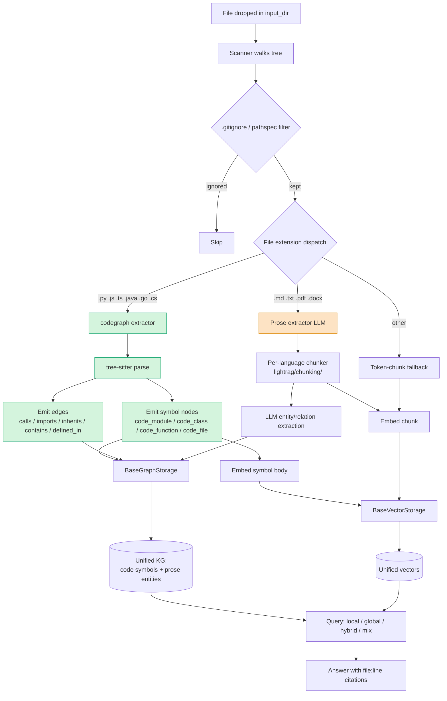

# Plan: Code-Graph Integration (LightRAG + Graphify ideas)

## Wins at a glance

| # | Win | Why it matters |
|---|-----|----------------|
| 1 | **No LLM tokens for code indexing** | Tree-sitter replaces per-chunk entity extraction — orders of magnitude cheaper on large repos. |
| 2 | **Deterministic graph** | Same code → same nodes/edges. No "hallucinated concepts"; reproducible across re-indexes. |
| 3 | **Real symbol identity** | Nodes carry FQN, repo-relative path, and line range. Answers include `file:line` citations out of the box. |
| 4 | **Scales where graphify stalls** | Uses LightRAG's pluggable `BaseGraphStorage` — Neo4j / Postgres / NetworkX. Tested on 100k+ node graphs. |
| 5 | **Structural queries become graph traversals** | "Where is X called?", "what does Y import?", "who inherits from Z?" stop being vector-search guesses. |
| 6 | **Cheap incremental re-index** | File changes only re-parse the file (AST is fast). No LLM re-run. Aligns with graphify's `--watch` idea for free later. |
| 7 | **Claude Code steered to the graph first** | `PreToolUse` hook on Glob/Grep/Read cuts redundant file-walks — Claude navigates symbols, not directories. |
| 8 | **Prose path untouched** | Docs / markdown / notebooks still go through the existing LLM extractor. No regression for non-code ingestion. |
| 9 | **Additive, narrow diff** | New directories under `lightrag/codegraph/` + minimal surgical edits — cheap rebases onto `HKUDS/main`. |
| 10 | **No fork of graphify** | One repo to maintain. Graphify stays a reference, not a merge obligation. |

## Ingestion flow



Green = new code path (Phase 1–2). Orange = existing prose path, unchanged.

## Goals
- Make this LightRAG fork a first-class **code-search** backend for Claude Code.
- Replace LLM prose-extraction over source with deterministic tree-sitter symbol extraction (the one thing graphify does well).
- Keep LightRAG's scalable storage backends (Neo4j / PG / NetworkX) and multi-mode retrieval (`local`/`global`/`hybrid`/`mix`).
- Stay additive: minimal diff against `HKUDS/main` so rebases stay cheap.

## Non-goals
- Vendoring or forking graphify.
- WebUI changes in v1.
- Breaking changes to `ainsert()` / `aquery()` public API.
- New storage backends.

---

## Fork / update strategy

### Graphify: do NOT fork
- Graphify is reference / inspiration, not a runtime dep.
- Useful pieces we reimplement natively:
  1. Tree-sitter AST symbol extraction (→ `lightrag/codegraph/`).
  2. Claude Code skill + `PreToolUse` hook pattern (→ `.claude/skills/lightrag/`).
- Graphify's engine (NetworkX-only, no server, no pluggable backends) is exactly what we want to bypass — vendoring would mean gutting the engine layer anyway.
- Track graphify's releases via GitHub watch; port ideas manually when they add a language or improve an AST query.
- Keep a `NOTICE.md` attributing the prior-art.

### LightRAG upstream: narrow additive fork
- Keep the diff **additive** — new directories (`lightrag/chunking/`, `lightrag/codegraph/`, `.claude/skills/`) instead of rewriting upstream code.
- Surgical edits only in hot files (`operate.py`, `lightrag.py`, `document_routes.py`); never reformat/refactor them in the same commits as feature work.
- **Rebase onto `HKUDS/main` weekly** and before every feature PR. Conflicts in `operate.py` are high-risk — investigate before resolving.
- Tag `pre-graphify` on the branch head before starting phase 1 for easy rollback.

---

## Phase 0 — Baseline (0.5 day)
- [ ] Rebase current branch onto `HKUDS/main`.
- [ ] Run `pytest tests` (offline) + `bun test` (webui) green.
- [ ] Tag `pre-graphify`.
- [ ] Confirm existing per-language chunking still works post-rebase.

## Phase 1 — Code symbol extractor (`lightrag/codegraph/`) (3–4 days)
- [ ] New package mirroring `chunking/` layout:
  - `_base.py`: `SymbolExtractor` protocol → returns `(nodes, edges)` tuples.
  - `_python.py`, `_javascript.py`, `_java.py`, `_go.py`, `_csharp.py` — one per language we already chunk.
- [ ] Add tree-sitter grammar deps to `pyproject.toml`: `tree-sitter`, `tree-sitter-python`, `tree-sitter-go`, `tree-sitter-java`, `tree-sitter-c-sharp`, `tree-sitter-javascript`.
- [ ] Node types (new entity_type values — don't collide with prose `person/organization/concept`):
  - `code_module`, `code_class`, `code_function`, `code_file`
- [ ] Edge types:
  - `calls`, `imports`, `inherits`, `contains`, `defined_in`
- [ ] Each node carries: fully-qualified name, repo-relative file path, line range, raw body (for embedding).
- [ ] Unit tests per language using fixture files under `tests/codegraph/fixtures/`.

## Phase 2 — Ingestion wiring (`operate.py` / new `ingest_code.py`) (2 days)
- [ ] Config flag `CODE_GRAPH_ENABLED` (default off) — .env + constructor param.
- [ ] In document pipeline, branch on file extension:
  - code files → `codegraph` extractor → write nodes/edges directly to `BaseGraphStorage`, embed node bodies into `BaseVectorStorage`, **skip LLM entity extraction**.
  - prose files → existing path unchanged.
- [ ] Reuse existing gitignore/pathspec + repo-relative path plumbing.
- [ ] Re-run on this repo, confirm graph counts look sane (symbols roughly ≈ top-level defs/classes).

## Phase 3 — Optional symbol descriptions (1–2 days, ship later)
- [ ] `lightrag/prompt_code.py` with short, cheap per-symbol description prompt.
- [ ] Called once per new symbol, not per chunk — orders of magnitude cheaper than current extraction.
- [ ] Populates `description` field so `mix` / `global` modes still produce coherent summaries.

## Phase 4 — Retrieval verification (1 day)
- [ ] No query-side code changes expected; graph storage is homogeneous.
- [ ] Eval queries: "where is X called", "what does module Y import", "find classes inheriting from Z".
- [ ] Confirm `mix` mode returns file:line citations (already stored repo-relative).

## Phase 5 — Claude Code skill (1 day)
- [ ] `.claude/skills/lightrag/SKILL.md` — trigger conditions, how to call the API.
- [ ] `PreToolUse` hook on `Glob` / `Grep` / `Read` that hints "query LightRAG first if codegraph index exists".
- [ ] Document env var for API base URL + token.
- [ ] Optional: thin MCP server wrapper exposing `search_code`, `find_callers`, `find_imports`.

## Phase 6 — Benchmarks (1 day)
- [ ] Index this repo end-to-end, record: ingest wall-clock, LLM tokens spent, graph node/edge counts.
- [ ] Same three numbers on graphify for comparison.
- [ ] Query quality spot-check on 10 fixed queries.

---

## Risk register
- **Rebase conflicts in `operate.py`** — mitigate by keeping feature code in new files and calling into it from a single edit site.
- **Tree-sitter grammar drift** — pin grammar versions in `pyproject.toml`; treat grammar bumps like dep upgrades.
- **Graph blow-up on huge monorepos** — Leiden/community detection is O(n log n) but embeddings dominate; make embedding-on-symbol optional per language.
- **Collision with existing prose extractor** on code files with heavy doc comments — solved by branching on extension in Phase 2; prose inside code is ignored by tree-sitter.

## Distribution: general-purpose, multi-repo, plugin-shaped

### Design goals (explicit)
1. One LightRAG install per user — works with any number of repos on disk.
2. Each repo gets its own graph (workspace isolation).
3. Skills/hooks are scoped per-repo via Claude Code's project-scope plugin install.
4. User installs LightRAG once, locally (no docker-compose required for basic use).
5. Integration shipped as a **Claude Code plugin** users add via `/plugin marketplace add` + `/plugin install`.

### Two-piece architecture

```
┌──────────────────────────────────────────┐
│ User machine (installed once)            │
│                                          │
│  lightrag-server  ──►  ~/.lightrag/      │
│  (listens on       (per-workspace graph  │
│   127.0.0.1:9621)   + vector storage)    │
└──────────▲───────────────────────────────┘
           │ HTTP, workspace=<repo-id>
           │
┌──────────┴───────────────────────────────┐
│ Claude Code plugin (per-repo install)    │
│                                          │
│  .mcp.json       → local MCP proxy       │
│  skills/         → /lightrag:query, etc. │
│  hooks/hooks.json→ PreToolUse on Glob/…  │
│  bin/lrag-ws     → derives workspace id  │
└──────────────────────────────────────────┘
```

- **Engine**: one daemon, multi-tenant. LightRAG's existing `workspace` parameter already isolates data per repo in every storage backend — nothing to invent.
- **Plugin**: a thin adapter. Knows nothing about RAG internals; just routes MCP calls to `http://127.0.0.1:9621/...?workspace=<id>`.

### Repo layout — monorepo with a `plugin/` subtree

```
lightrag-fork/                            # the engine repo (this one)
├── lightrag/                             # Python package (unchanged)
├── plugin/                               # Claude Code plugin
│   ├── .claude-plugin/
│   │   └── plugin.json                   # name, version, description
│   ├── .mcp.json                         # launches the MCP proxy below
│   ├── skills/
│   │   ├── query/SKILL.md                # /lightrag:query
│   │   ├── index/SKILL.md                # /lightrag:index
│   │   └── status/SKILL.md               # /lightrag:status
│   ├── hooks/
│   │   └── hooks.json                    # PreToolUse on Glob/Grep/Read
│   ├── bin/
│   │   └── lrag-mcp-proxy                # stdio MCP server → LightRAG HTTP
│   └── README.md
├── .claude-plugin/
│   └── marketplace.json                  # advertises ./plugin/ as "lightrag"
└── PLAN_CODEGRAPH.md
```

Marketplace JSON at repo root advertises the plugin at `./plugin/`. Users add the **fork repo** as a marketplace; the fork hosts both engine and plugin.

### End-user install (happy path)

```bash
# 1. Install the engine once (user scope, no sudo).
uv tool install "lightrag[api] @ git+https://github.com/<you>/lightrag-fork@main"
lightrag-server &                              # background daemon

# 2. In any repo, enable the plugin once.
#    (inside Claude Code, not shell)
/plugin marketplace add <you>/lightrag-fork
/plugin install lightrag@lightrag-fork         # choose "project scope"

# 3. Index the current repo.
/lightrag:index
```

That's it. Repeat step 2 in every repo you want indexed; the daemon from step 1 serves all of them.

### Per-repo scoping — two layers

1. **Plugin scope** (which repos see the commands/hooks at all)
   Users install at *project scope*, which writes `.claude/settings.json` with `enabledPlugins` and `extraKnownMarketplaces`. Commit this file → teammates get the same setup.

2. **Data scope** (which graph gets queried)
   The MCP proxy derives a `workspace` id from `$CLAUDE_PROJECT_DIR` on every call — e.g., `sha1(git_remote_url || abs_repo_path)[:16]`. The LightRAG daemon persists each workspace under `~/.lightrag/<workspace_id>/` (or a Postgres row with that workspace column). Zero cross-contamination between repos.

### The MCP proxy (what `bin/lrag-mcp-proxy` does)

Tiny Python script (~150 LOC), shipped inside the plugin, launched via `.mcp.json`:
- Reads `CLAUDE_PROJECT_DIR` env var (Claude Code sets this).
- Computes workspace id.
- Exposes MCP tools: `search_code`, `find_callers`, `find_imports`, `reindex`, `status`.
- Each tool does `httpx.post("http://127.0.0.1:9621/...", params={"workspace": ws_id})`.
- No RAG logic — pure transport.

### Ingestion trigger

`/lightrag:index` skill calls `reindex` MCP tool → daemon runs the Phase 1–2 pipeline (tree-sitter for code, prose extractor for docs) scoped to that workspace. Incremental: only re-parses files with newer mtime than the last index timestamp stored per-workspace.

### Update flow

| Change | User action | Effect |
|---|---|---|
| Engine fork released v1.1 | `uv tool upgrade lightrag` | Daemon picks up new code; existing graphs preserved. |
| Plugin released v1.1 | `/plugin update lightrag` | New skill versions in each repo that enabled it. |
| Code in a repo changed | `/lightrag:index` (or post-commit hook) | Incremental re-parse of changed files only. |
| User clones a new repo | `/plugin install lightrag@lightrag-fork` in that repo | New workspace, new graph, same daemon. |

### Why this shape hits all five goals

| Goal | How it's satisfied |
|---|---|
| Multi-repo | One daemon serves N workspaces. |
| Per-repo graph | `workspace` param is LightRAG's existing isolation primitive. |
| Skills scoped to repo | Plugin installed at *project scope*; `.claude/settings.json` pins it. |
| User installs locally | `uv tool install` → one binary on PATH. |
| Plugin-style install | Real Claude Code plugin with marketplace + MCP + skills + hooks. |

### Out of scope for v1
- Auto-starting the daemon on OS login (ship a `launchd`/`systemd` snippet in docs, don't build an installer).
- Shared team daemon (single-user assumption — revisit if teams want it).
- Team-level marketplace server (users point at the fork repo directly).

## Change detection & re-indexing

### Primary mechanism: content-hash manifest diff

Per workspace, keep `~/.lightrag/<workspace_id>/manifest.json`:

```json
{
  "indexed_at": "2026-04-23T10:15:00Z",
  "files": {
    "src/auth/login.py":  {"sha256": "a1b2…", "mtime": 1714012345, "size": 4210},
    "src/auth/models.py": {"sha256": "c3d4…", "mtime": 1714012000, "size": 1880}
  }
}
```

On every `/lightrag:index` (manual, hook-triggered, or scheduled):

1. Walk repo (existing gitignore-aware scanner).
2. For each file: cheap `mtime` check → only re-hash when mtime differs.
3. Three-way diff against manifest: `added`, `modified`, `deleted`, `unchanged`.
4. For each `added` / `modified` file:
   - Tree-sitter re-parse (code) or LLM re-extract (prose).
   - **Purge all nodes/edges where `defined_in == <file>` before re-inserting.**
   - Upsert new symbols (keyed by FQN so cross-file edges survive).
5. For each `deleted` file: drop all nodes/edges where `defined_in == <file>`.
6. Rewrite manifest.

**Why hash, not mtime alone:** `git checkout` resets mtime on files that didn't actually change content; mtime-only would trigger spurious re-index on every branch switch. Hash-first short-circuits the expensive step (parse / LLM) correctly.

**The stale-symbol gotcha:** if step 4 skips the purge, the graph accretes zombie nodes for deleted functions. This is the one subtle invariant to get right — every write path goes through `delete-by-file` then `insert`.

### Trigger tiers

| Tier | Trigger | Catches | Opt-in? |
|---|---|---|---|
| 1 | `/lightrag:index` slash command | Everything (manual) | Always on |
| 2 | Git hooks: `post-merge`, `post-checkout`, `post-commit`, `post-rewrite` | `git pull`, branch switch, rebase, commit | Per-repo, installed via `/lightrag:install-git-hooks` |
| 3 | Claude Code `PostToolUse` hook on `Edit`/`Write`/`NotebookEdit` | Claude's own edits | Shipped in plugin, user can disable |
| 4 | `--watch` daemon (`watchdog` lib) | External edits in IDE | Deferred — fragile on network FS + inotify limits |

Tiers 1–3 cover ~all realistic cases without a background watcher. Tier 2 is the most important — it's what makes `git pull` "just work". Tier 3 gives instant feedback after every Claude edit without waiting for a commit.

### Git hook contents (what tier 2 installs)

All hooks call the same thing:

```sh
#!/bin/sh
# .git/hooks/post-merge (and post-checkout, post-commit, post-rewrite)
curl -fsS -X POST \
  "http://127.0.0.1:9621/reindex?workspace=$(lrag-ws-id)" \
  --max-time 2 || true  # fire-and-forget; never block the git op
```

- `--max-time 2` + `|| true` — indexing never slows down git itself.
- Daemon queues the reindex and returns immediately.
- `lrag-ws-id` is the same helper the MCP proxy uses — consistent workspace derivation.

### Git pull — exact flow

1. User runs `git pull` in terminal.
2. Git fast-forwards / merges → fires `post-merge` hook.
3. Hook pings daemon with workspace id.
4. Daemon enqueues a manifest diff; returns `202 Accepted`.
5. Worker thread diffs, purges stale symbols, re-parses modified files (tree-sitter, fast), re-runs LLM only on modified prose files.
6. Next query hits the updated graph.

No manual step, no watcher process, works identically whether the pull came from CLI, an IDE, or a GitHub Desktop sync.

### Branch switching

`post-checkout` covers it the same way. Because the diff is content-based, switching between branches with 1000 changed files still only re-parses the genuinely different ones; switching back is near-instant (manifest already matches).

### Submodules (parent repo pulls changes into a submodule)

`git submodule update` does **not** fire `post-merge` on the parent. Two options:

- **Hook inside the submodule itself**: if you run `/lightrag:install-git-hooks` inside each submodule, its own `post-merge` fires when its tip moves.
- **Parent alias**: document a `git subup` alias that runs submodule update + `curl reindex`. Ship as a doc snippet, not code.

Default recommendation: install hooks in repos you actively query. Submodules you rarely touch can live on manual `/lightrag:index`.

### What's stored where (so refresh is reasoning, not guessing)

| Artifact | Location | Rebuilt on |
|---|---|---|
| Manifest (file → hash) | `~/.lightrag/<ws>/manifest.json` | Every re-index |
| Code symbols (nodes/edges) | `BaseGraphStorage` (PG/Neo4j/NetworkX) | Per-file on change |
| Symbol embeddings | `BaseVectorStorage` | Per-file on change |
| LLM cache (prose) | `BaseKVStorage` | Reused across re-indexes |
| Doc status | `BaseDocStatusStorage` | Updated after each file |

The LLM cache is the reason re-indexing after a `git pull` on a prose-heavy repo is still cheap — identical chunks hit cache.

## Out of scope for v1
- `--watch` daemon (tier 4 above).
- Cross-repo symbol resolution.
- Non-code assets (markdown, notebooks) beyond what upstream already handles.
